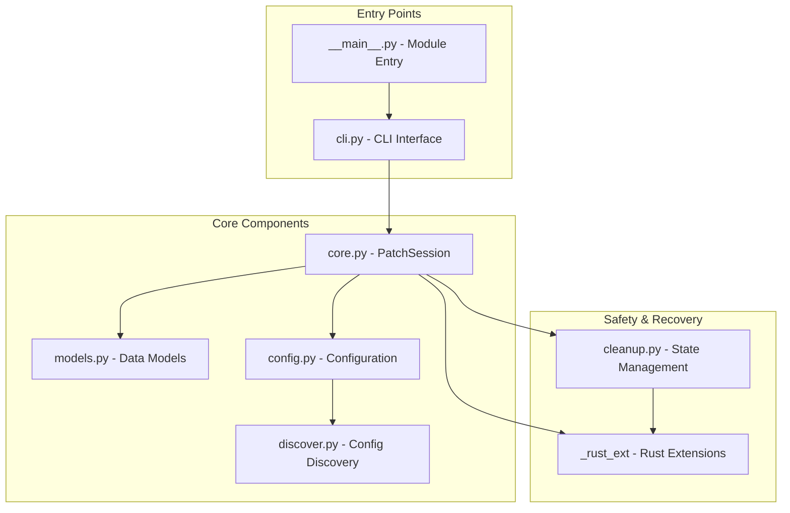
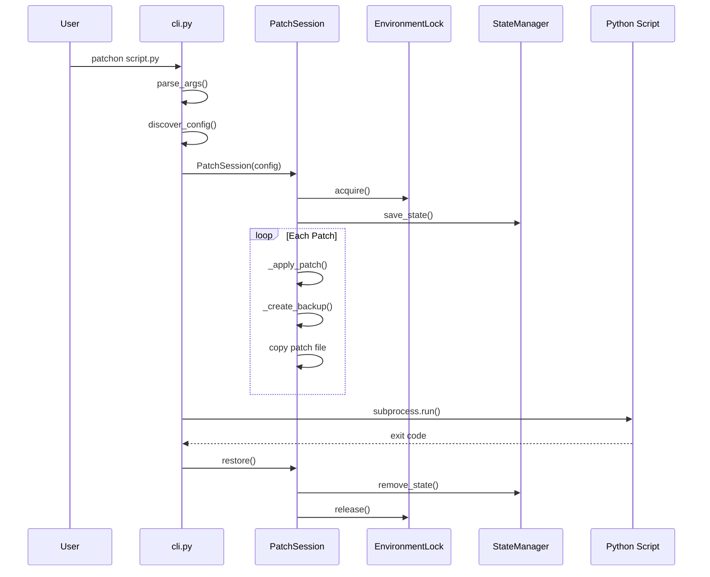

# Architecture

This document describes the internal architecture of `patchon` and how its components work together.

## Overview



## Core Components

### PatchSession (`core.py`)

The `PatchSession` class is the heart of patchon. It manages:

1. **Environment Locking**: Prevents concurrent patching of the same packages
2. **Patch Application**: Applies patches from configured patch roots to target packages
3. **Backup Management**: Creates and manages backups of original files
4. **Automatic Restoration**: Restores originals on exit via `atexit` handler
5. **State Persistence**: Saves state for crash recovery

```python
session = PatchSession(config, dry_run=False)
session.apply_all()  # Apply all patches
# ... run script ...
session.restore()    # Restore original files
```

### Data Models (`models.py`)

Simple dataclasses for configuration:

| Class | Purpose |
|-------|---------|
| `Config` | Main configuration container |
| `PatchConfig` | Configuration for a single patch target |

### Configuration (`config.py` & `discover.py`)

- **`discover.py`**: Auto-discovers configuration by walking up directory tree
- **`config.py`**: Parses `pyproject.toml` and YAML configurations

Configuration discovery order:
1. `pyproject.toml` with `[tool.patchon]` section
2. `patchon.yaml` file

### Cleanup & Recovery (`cleanup.py`)

Handles recovery from crashes and SIGKILL:

| Component | Purpose |
|-----------|---------|
| `PatchState` | Serializable state tracking for active sessions |
| `StateManager` | Persistence of state to temp directory |
| `find_orphaned_backups()` | Locates backups from dead processes |
| `cleanup_all()` | Restores all orphaned backups |

State is saved to a temp directory (`/tmp/patchon_state/` on Linux) and cleaned up on normal exit.

## Rust Extensions (`_rust_ext`)

Optional Rust-accelerated components for performance-critical operations:

| Function | Purpose |
|----------|---------|
| `fast_file_copy()` | High-performance file copying |
| `batch_copy_operations()` | Optimized batch file operations |
| `scan_python_files()` | Fast Python file discovery |
| `EnvironmentLock` | Cross-platform file locking |
| `is_process_alive()` | Check if a process is running |

If the Rust extension is not available, pure Python fallbacks are used.

## Execution Flow



## Safety Mechanisms

### 1. Environment Locking

Prevents concurrent modification conflicts:

```python
env_id = generate_env_id(["requests", "urllib3"])
lock = EnvironmentLock(timeout=60.0)
if not lock.acquire(env_id):
    raise RuntimeError("Another process is patching these packages")
```

### 2. Backup Verification

Every patched file has a backup stored in temp directory with content verification.

### 3. State Persistence

State is saved after each backup is created:

```json
{
  "version": 1,
  "pid": 12345,
  "env_id": "abc123...",
  "backups": {
    "/path/to/original.py": "/tmp/backup.py.backup"
  },
  "patched_files": ["/path/to/original.py"],
  "timestamp": "2024-01-15T10:30:00"
}
```

### 4. Automatic Cleanup

`atexit` handler ensures restoration even on uncaught exceptions.

## Error Handling

| Scenario | Response |
|----------|----------|
| Lock acquisition failure | Error with helpful message |
| Version mismatch | Error (if `strict=true`) or warning |
| Backup failure | Skip patch, continue or abort based on `strict` |
| Patch application failure | Restore from backup, report error |
| Process crash (SIGKILL) | `--cleanup` command recovers |
